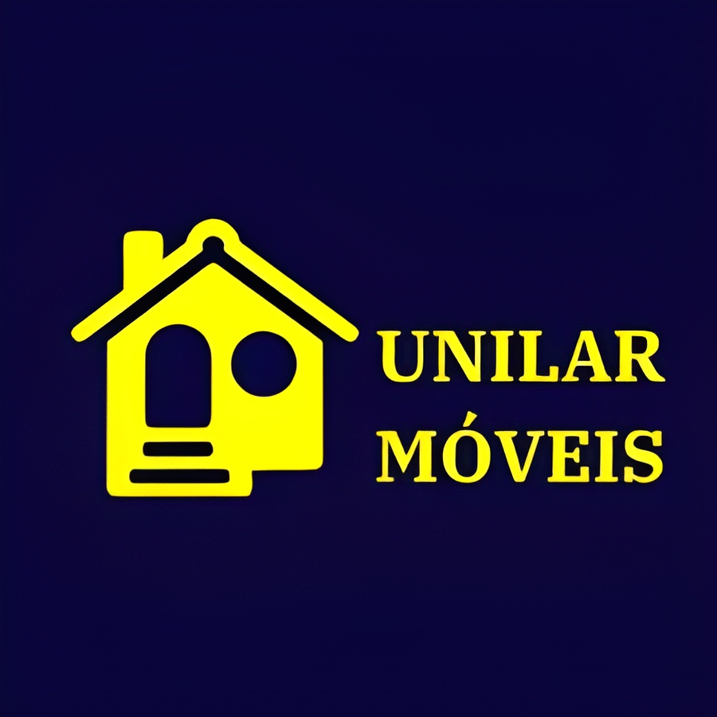

# Unilar Móveis 🪑

  
   
  

 

> Projeto de e-commerce focado em mobiliário, desenvolvido com o objetivo de estudo aprofundado em desenvolvimento web Full Stack.

---

## 🎯 Objetivo

Este repositório destina-se ao desenvolvimento de uma loja virtual para a **Unilar Móveis**. O objetivo principal não é apenas o produto final, mas o processo de aprendizado das tecnologias **React** e **Node.js**.

O projeto visa explorar:
* Criação de interfaces modernas e reativas (SPA).
* Comunicação entre Frontend e Backend (API REST).
* Gerenciamento de estado global na aplicação.

## 🚀 Funcionalidades Planejadas

O escopo inicial do projeto prevê a implementação das seguintes funcionalidades principais:

* **Vitrine Virtual:** Exibição de produtos (móveis) com imagens e preços.
* **Sistema de Busca e Filtros:** Capacidade de encontrar móveis por categoria ou faixa de preço.
* **Painel do Produto:** Página de detalhes com especificações técnicas do móvel.
* **Design Responsivo:** Interface adaptável para dispositivos móveis.

## 🛠️ Tecnologias

A base tecnológica do projeto será:

* **Frontend:** React (Hooks, Componentes Funcionais).
* **Backend:** Node.js.
* **Outras ferramentas:** A serem definidas conforme a necessidade do projeto (ex: bibliotecas de estilização, banco de dados, etc).

---

Desenvolvido por **Gabriel Maçolla**